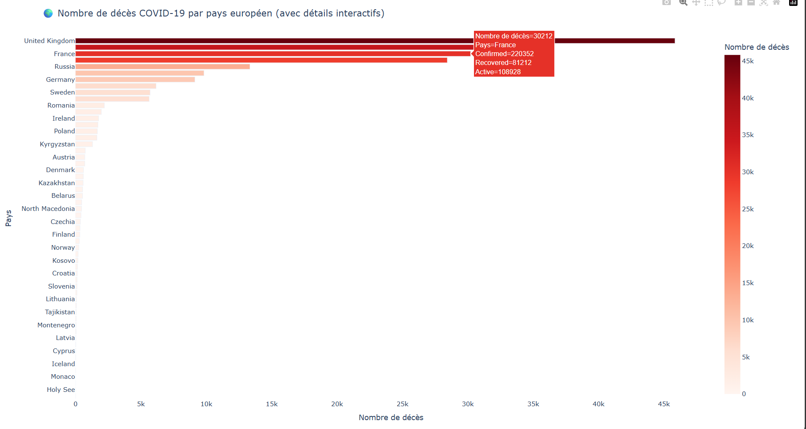

# 🌍 COVID-19 Europe Data Visualization Dashboard  
*Analyse interactive des données COVID-19 en Europe avec Python, MongoDB et Plotly*

---

## 📌 Description du Projet  
Pipeline complet d'analyse des données COVID-19 pour les pays européens :  
1. **Import** des données depuis un fichier CSV  
2. **Stockage** dans une base MongoDB locale  
3. **Nettoyage** et requêtage ciblé (pays européens)  
4. **Visualisation interactive** avec Plotly (graphiques à barres horizontales)  

**Objectif** : Permettre une analyse comparative des décès/confirmés/guérisons entre pays.  

---

## 🛠️ Stack Technique  
### Langages & Bibliothèques  
- **Python 3.9** (Pandas, PyMongo, Plotly)  
- **MongoDB** (base NoSQL locale)  
- **Visualisation** : Plotly Express (interactivité), Matplotlib/Seaborn  

### Fonctionnalités Clés  
- Filtrage automatique des pays européens  
- Tri par nombre de décès  
- Tooltips interactifs (survol pour voir confirmés/guérisons/actifs)  
- Échelle de couleurs ("Reds") pour l'intensité des décès  

---

## 📊 Visualisation Interactive

*Graphique des décès par pays européen - Données ECDC*

---

## ⚙️ Structure du Code  
```python
import pandas as pd
from pymongo import MongoClient
import matplotlib.pyplot as plt
import seaborn as sns
import plotly.express as px
import plotly.io as pio
pio.renderers.default = "browser"
print("\U0001F4C2 Lecture du fichier CSV...")
df = pd.read_csv("country_wise_latest.csv")
print("\U0001F5A5 Connexion à MongoDB...")
client = MongoClient("mongodb://localhost:27017/")
db = client["covid_db"]
collection = db["country_stats"]
print("\u267B\ufe0f Nettoyage de la collection existante...")
collection.delete_many({})
print("\U0001F4BE Insertion des données dans MongoDB...")
data_dict = df.to_dict("records")
collection.insert_many(data_dict)
print("\U0001F5C3\ufe0f Requête des données pour les pays européens...")
europe_data = list(collection.find(
    {"WHO Region": "Europe"},
    {"_id": 0, "Country/Region": 1, "Deaths": 1, "Confirmed": 1, "Recovered": 1, "Active": 1}
))
print("\U0001F4CA Préparation des données pour la visualisation...")
europe_df = pd.DataFrame(europe_data)
europe_df = europe_df.sort_values(by="Deaths", ascending=False)
print("\U0001F5BC\ufe0f Création d'une visualisation interactive avec Plotly...")
fig = px.bar(
    europe_df,
    x="Deaths",
    y="Country/Region",
    orientation='h',
    color="Deaths",
    hover_data={"Confirmed": True, "Recovered": True, "Active": True, "Deaths": True, "Country/Region": True},
    labels={"Deaths": "Nombre de décès", "Country/Region": "Pays"},
    title="\U0001F30D Nombre de décès COVID-19 par pays européen (avec détails interactifs)",
    color_continuous_scale="Reds"
)

fig.update_layout(
    yaxis=dict(autorange="reversed"),
    margin=dict(l=100, r=50, t=80, b=50),
    plot_bgcolor='white'
)

fig.show()
client.close()
print("\u2705 Terminé : Données COVID-19 indexées et visualisées avec animation interactive !")
europe_data = collection.find({"WHO Region": "Europe"}, {"_id": 0, ...})

# 5. Visualisation Plotly
fig = px.bar(..., orientation='h', color_continuous_scale="Reds")
fig.show()
